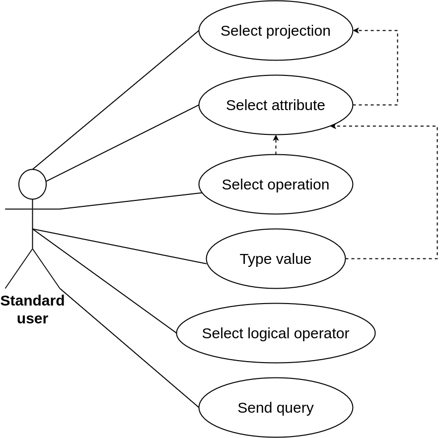
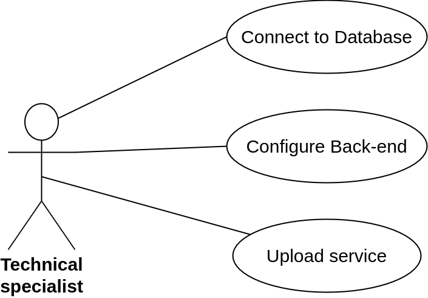

# MAC0332 - Search Service

## Build

To execute the project using Docker, run the following commands:

```
cd search-service

docker compose build

docker compose up
```
## Environment Variables (inside docker compose)

```
DB_HOST: dbms host
DB_PORT: dbms port
DB_USER: dbms user
DB_PASS: dbms password
DB_NAME: database name
ALLOWED_SCHEMAS: database schemas that can be queried
FRONT_END_HOST: host of the front-end application
```

## Tests

To execute the tests, make sure the database is correctly populated, then run:

```
cargo test
```

## Sample Database population

1. [PostgreSQL source and instructions](database/sample/postgresql/README.md)

<br>
<br>

# Features

This system provides a complex database search service that allows anyone to search for information in a database without having knowledge of its schema, the language used to make queries or the DBMS. Thus, we implemented the following features:

- Connect to a database
- Obtain general DB schema information (relationships and data types)
- Identify data types to restrict allowed operations 
- Allow queries with logical operations (And, Or)
- Allow queries with joins
- Provide a front-end template

<br>
<br>


# Use cases

The following use cases examples describe the interaction with two different types of users, according to some of the system features:

### 1. Standard user

A standard user, i.e. people with or without knowledge in DBs, will be able to select the attributes that wishes to project and the query filters.

<center>
    
</center>

<br>

### 2. Technical specialist

A technical specialist, i.e. software engineers, will configurate the system to make the connection with the database and other configurations to enable the standard user to use it.

<center>
    
</center>

<br>
<br>


# Architecture

### 1. [Relational table search](search-service/src/relational/README.md)

### 2. [Language interpretation](search-service/src/query_representation/README.md)