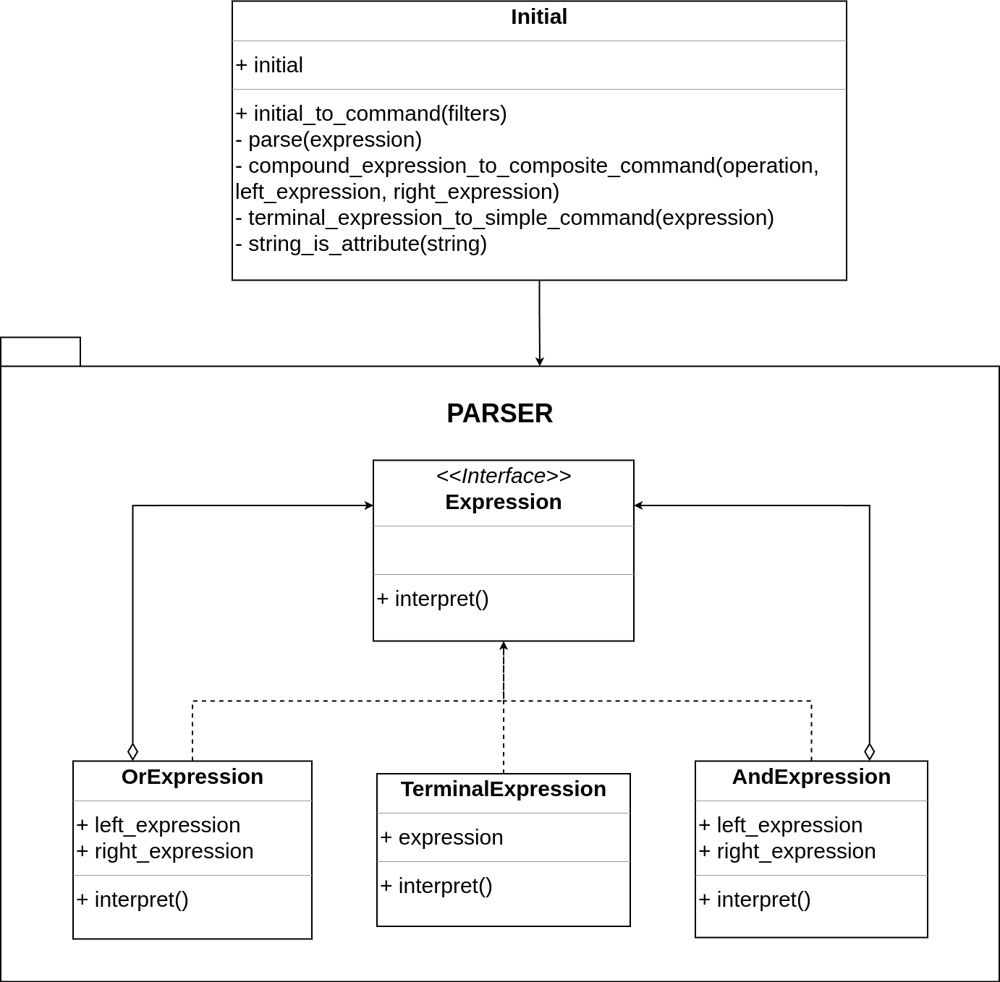
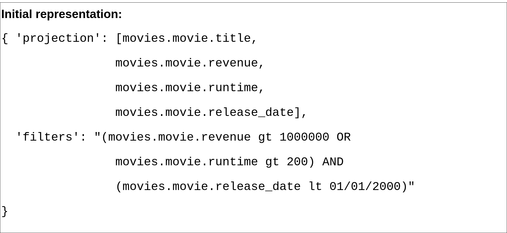
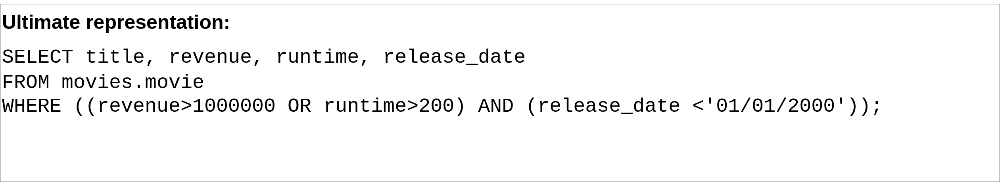

# MAC0332 - Search service

## Build

To execute the project using Docker, run the following commands:

```
cd search-service

docker compose build

docker compose up
```
## Environment Variables (inside docker compose)

```
DB_HOST: dbms host
DB_PORT: dbms port
DB_USER: dbms user
DB_PASS: dbms password
DB_NAME: database name
ALLOWED_SCHEMAS: database schemas that can be queried
```

## Tests

To execute the tests, make sure the database is correctly populated, then run:

```
cargo test
```

## Sample Database population

1. [PostgreSQL source and instructions](database/sample/postgresql/README.md)

<br>
<br>

# Architecture

## Front-end parser



## Command


## Visitor


## Query representation

### Initial representation


### Intermediary representation


### Ultimate representation
