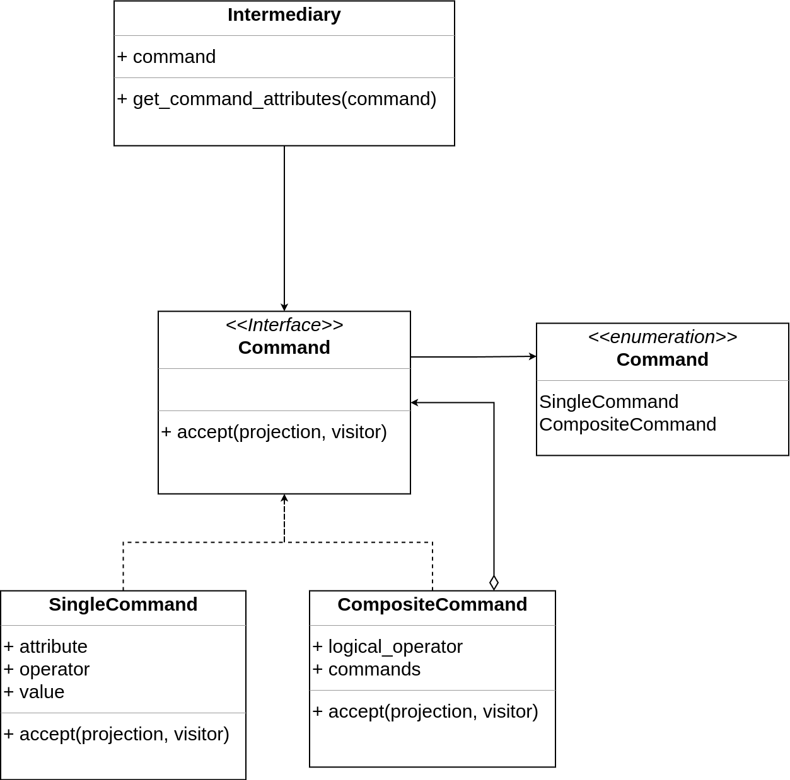

# Architecture

In order to obtain the query in a database language we translate the entries choosen by the user just like a language interpreter does. 

First, we parse the initial representation that comes from the front-end into an intermediary one, which is a recursive structure. Then we can operate over it to obtain the final query. This is done according to the following architecture.

## Front-end parser

The Parser module receives a json from the front-end and parses the filter expressions to interpret them as Commands, recursively. Thus, the Interpreter design pattern defines an intermediary grammatical representation for the query (Command).

    

## Command

Commands are represented by the Composite pattern, forming a tree-like structure where the leaves (Single Commands) represent simple conditions of a query filter and the nodes (Composite Commands) are conditions that have logical operators.

    

## Visitor

Visitor operations are then applied to commands to obtain the final string query in a specific database language.

    

 

The separation of language representations and operations enables the use of different database languages and DBMSs, promoting system scalability.

## Query representation

The tree different types of query (or language) representations are shown bellow.

### Initial representation

A json object is assembled in the front-end. This initial representation contains a list of attributes to be projected and a string with filters for the complex database search.

    

### Intermediary representation

The intermediary language is a nested structure called Command that portray only the filters of the previous representation.

    

### Ultimate representation

Finally, the ultimate representation is a string of the query in a specific database language.

    

