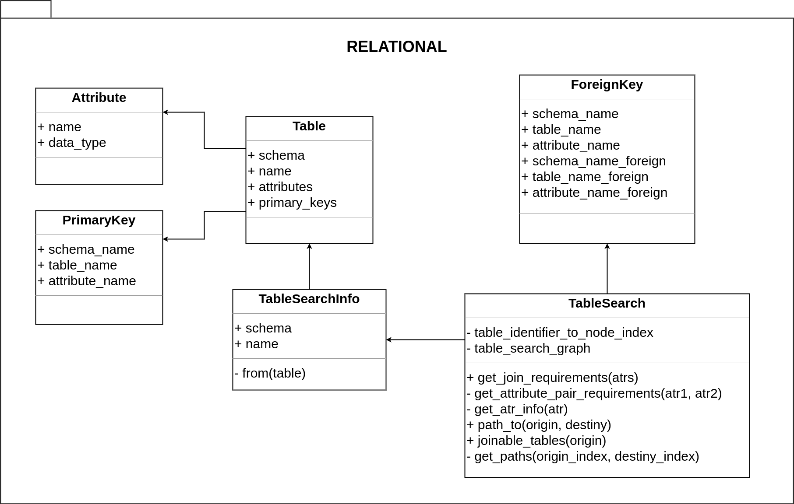

# Architecture

The Relational module allows you to both obtaining the database schema and define joinable tables.

Main components of a relational database are represented by the Table, Attribute, PrimaryKey and ForeignKey classes.

TableSearchInfo provides general database schema informations, such as relationships and data types.

The TableSearch class defines a graph to represent all connections (foreign keys) between joinable tables to enable queries with join operations and a better user experience by restricting the allowed operations.

    

