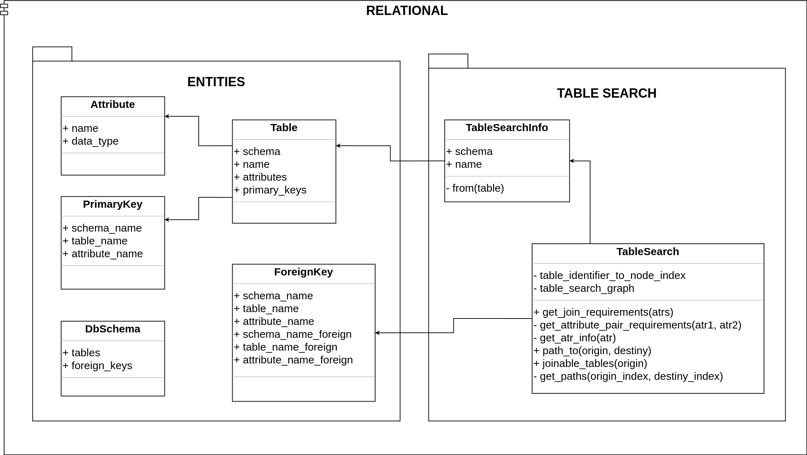

# Relational Module Architecture

The Relational module defines the database entities and
allows you to both obtain the database schema and define joinable tables.

Entities of a relational database are represented by the Table, Attribute, PrimaryKey, ForeignKey and DbSchema classes.

TableSearchInfo provides general database schema informations, such as relationships and data types.

The TableSearch class defines a graph to represent all connections (foreign keys) between joinable tables to enable queries with join operations and a better user experience by restricting the allowed operations.

    

